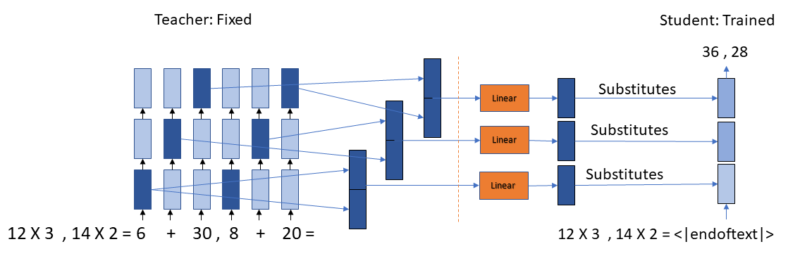
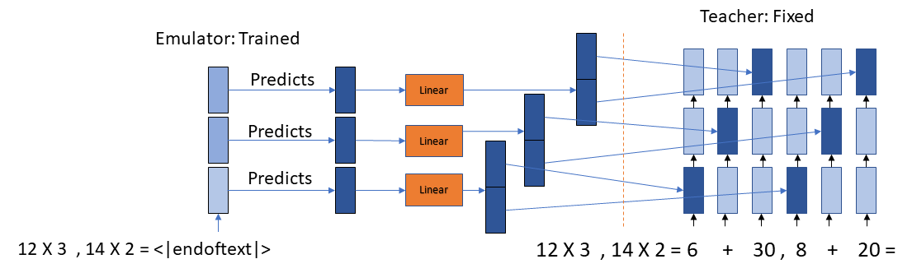
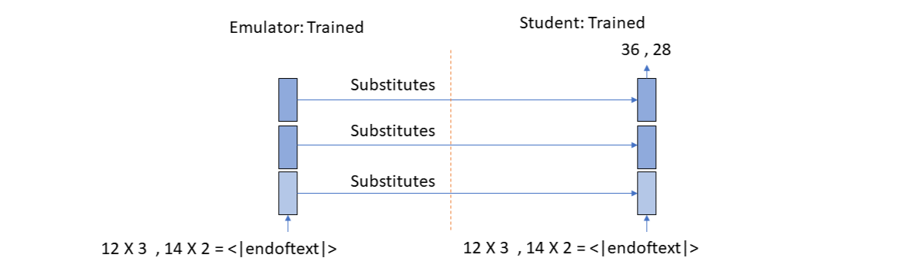

# Implicit Chain of Thought Reasoning for Two Multiplication Simultaneously Challenge

## Preamble

This repository is an attempt to solve the challenge shown in Figure: 1. The <a href="https://github.com/da03/implicit_chain_of_thought.git">Implicit_CoT</a> training illustration is shown in Figure: 2. The training illustration for the challenge is shown in Figure: 3.
<div>


</div>

## Datasets & Pretrained Models & Logs

All dataset files and log files during inference are included in this repo, with the exception of large training files maintained under Git LFS. Model checkpoints are stored on Google Drive. The folder containing all checkpoints can be found at [this link](https://drive.google.com/drive/folders/1Sclr5bmLZIUcktCaFAeWRTevRGLUwlC_?usp=drive_link).

* 4 X 4 Mult - GPT-2: [data](data/4_by_4_mult/) [model](https://drive.google.com/drive/folders/1Zp-PFwiHkwq0wuFScjN5R8jDdXdnQYQ_?usp=sharing) [log](logs/4_by_4_mult/gpt2/log.generate)


## Usage

We use 4 X 4 Mult with GPT2-Small as an example. We assume that the working directory is `implicit_chain_of_thought` throughout this document.

### Data Format

The format of training, validation, and test files looks like below:

```
[input 1a] , [input 1b]||[chain-of-thought 1a] , [chain-of-thought 1b] #### [output 1a] , #### [output 1b] 
[input 2a] , [input 2b]||[chain-of-thought 2a] , [chain-of-thought 2b] #### [output 2a] , #### [output 2b]
[input 3a] , [input 3b]||[chain-of-thought 3a] , [chain-of-thought 3b] #### [output 3a] , #### [output 3b] 
...
```

As an example, let's take a look at the first line from the 4 X 4 Mult test set in [data/4_by_4_mult/test_bigbench.txt](data/4_by_4_mult/test_bigbench.txt):

```
5 6 3 2 * 7 4 3 4 , 7 1 0 8 * 8 4 8 2 <|endoftext|> 5 5 5 6 1 + 0 0 6 4 9 0 ( 5 5 1 1 1 1 ) + 0 0 5 9 0 7 0 ( 5 5 6 0 2 8 0 ) + 0 0 0 0 6 4 9 0 , 5 3 2 3 4 + 0 4 9 2 7 1 ( 5 7 1 6 1 2 ) + 0 0 8 8 5 4 3 ( 5 7 9 4 7 6 3 ) + 0 0 0 6 7 1 9 6 <|endoftext|> #### 5 5 6 0 8 2 0 1 , #### 5 7 9 0 5 8 2 7 <|endoftext|>
```

Note that for Teacher Training, (a) Mind-Reading the Teacher, and (b) Thought Emulation, the chain-of-thought steps are used; but for (c) Couple and Optimize the chain-of-thought steps are not used.

### Training

#### Training Notebook

All the three training steps are given sequentially in the notebook:

```
src\implicit_cot.ipynb
```

#### Prerequisite: Teacher Training

Our approach is based on distilling a teacher models horizontal reasoning process into the vertical reasoning process of the emulator and the student. Therefore, we need to first train a teacher on the task of explicit chain-of-thought reasoning.

```
export FOLDER=data/4_by_4_mult
export MODEL=gpt2
export EPOCHS=2
export LR=5e-5
export BSZ=8
export SAVE=train_models/4_by_4_mult/gpt2/teacher
echo $SAVE
mkdir -p $SAVE
TOKENIZERS_PARALLELISM=false CUDA_VISIBLE_DEVICES=0 stdbuf -oL -eL python src/train_teacher.py \
    --train_path ${FOLDER}/train.txt \
    --val_path ${FOLDER}/valid.txt \
    --epochs $EPOCHS \
    --lr $LR \
    --batch_size $BSZ \
    --base_model $MODEL \
    --save_model $SAVE \
    > ${SAVE}/log.train 2>&1&
```

#### (a) Mind-Reading the Teacher



```
export FOLDER=data/4_by_4_mult
export DELTA=dynamic
export MODEL=gpt2
export EPOCHS=10
export LR=5e-5
export BSZ=8
export TEACHER=train_models/4_by_4_mult/gpt2/teacher/checkpoint_0
export SAVE=train_models/4_by_4_mult/gpt2/student_initial
mkdir -p $SAVE
TOKENIZERS_PARALLELISM=false CUDA_VISIBLE_DEVICES=0 stdbuf -oL -eL python src/train_mind_reading_student.py \
    --train_path ${FOLDER}/train.txt \
    --val_path ${FOLDER}/valid.txt \
    --epochs $EPOCHS \
    --lr $LR \
    --batch_size $BSZ \
    --base_model $MODEL \
    --teacher $TEACHER \
    --save_model $SAVE \
    --delta $DELTA \
    > ${SAVE}/log.train 2>&1&
```

#### (b) Thought Emulation



```
export FOLDER=data/4_by_4_mult
export DELTA=dynamic
export MODEL=gpt2
export EPOCHS=10
export LR=5e-5
export BSZ=8
export MIXTURE_SIZE=1
export TEACHER=train_models/4_by_4_mult/gpt2/teacher/checkpoint_0
export SAVE=train_models/4_by_4_mult/gpt2/emulator_initial
mkdir -p $SAVE
TOKENIZERS_PARALLELISM=false CUDA_VISIBLE_DEVICES=0 stdbuf -oL -eL python src/train_thought_emulator.py \
    --train_path ${FOLDER}/train.txt \
    --val_path ${FOLDER}/valid.txt \
    --epochs $EPOCHS \
    --lr $LR \
    --batch_size $BSZ \
    --base_model $MODEL \
    --teacher $TEACHER \
    --save_model $SAVE \
    --delta $DELTA \
    --mixture_size ${MIXTURE_SIZE} \
    > ${SAVE}/log.train 2>&1&
```

#### (c) Couple and Optimize



```
export FOLDER=data/4_by_4_mult
export EPOCHS=10
export LR=5e-5
export BSZ=8
export STUDENT=train_models/4_by_4_mult/gpt2/student_initial/checkpoint_6
export EMULATOR=train_models/4_by_4_mult/gpt2/emulator_initial/checkpoint_5
export SAVE=train_models/4_by_4_mult/gpt2/
mkdir -p $SAVE
TOKENIZERS_PARALLELISM=false CUDA_VISIBLE_DEVICES=0 stdbuf -oL -eL python src/train_coupled_emulator_and_student.py \
    --train_path ${FOLDER}/train.txt \
    --val_path ${FOLDER}/valid.txt \
    --epochs $EPOCHS \
    --lr $LR \
    --batch_size $BSZ \
    --student $STUDENT \
    --emulator $EMULATOR \
    --save_model $SAVE \
    > ${SAVE}/log.train 2>&1&
```

### Generation & Evaluation

Here we use a pretrained model as an example. Download the folder `models/4_by_4_mult/gpt2`, then the following command will run inference and evaluate both accuracy and throughput, logged in file `generation_logs/4_by_4_mult/log.generate`.

```
export FOLDER=data/4_by_4_mult
export STUDENT=models/4_by_4_mult/gpt2/student
export EMULATOR=models/4_by_4_mult/gpt2/emulator
export BSZ=1
export SAVE=generation_logs/4_by_4_mult
mkdir -p $SAVE
TOKENIZERS_PARALLELISM=false CUDA_VISIBLE_DEVICES=0 stdbuf -oL -eL python src/generate.py \
    --batch_size $BSZ \
    --test_path ${FOLDER}/test_bigbench.txt \
    --student_path $STUDENT \
    --emulator_path $EMULATOR \
    > ${SAVE}/log.generate 2>&1&
```

## Citation

```
@misc{deng2023implicit,
      title={Implicit Chain of Thought Reasoning via Knowledge Distillation}, 
      author={Yuntian Deng and Kiran Prasad and Roland Fernandez and Paul Smolensky and Vishrav Chaudhary and Stuart Shieber},
      year={2023},
      eprint={2311.01460},
      archivePrefix={arXiv},
      primaryClass={cs.CL}
}
```
